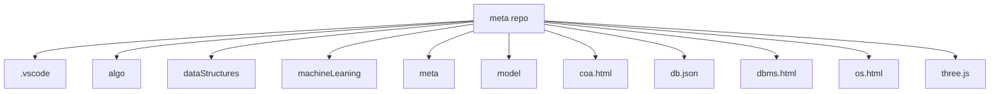

# 📂 Meta Repository

A collection of multiple programming and project-related resources, covering **Algorithms, Data Structures, Machine Learning, Models, and Web Development**.

## 📑 Repository Structure

meta/
├── .vscode/ 

├── algo/ 

├── dataStructures/ 

├── machineLeaning/ 

├── meta/ 

├── model/ 

├── coa.html

├── db.json

├── dbms.html

├── os.html 

└── three.js 

## 📊 Language Breakdown

---

## 🗂 Contents Overview

### 📁 **algo/**
- Contains various algorithm implementations with step-by-step explanations.

### 📁 **dataStructures/**
- Data structure code snippets and notes for quick reference.

### 📁 **machineLeaning/**
- Machine learning scripts, models, and experiments.

### 📁 **meta/**
- Repository meta files and configs.

### 📁 **model/**
- Saved/trained ML models or configuration files.

### 📄 **coa.html**
- Notes and resources for **Computer Organization & Architecture**.

### 📄 **dbms.html**
- Comprehensive notes on **Database Management Systems**.

### 📄 **os.html**
- Notes on **Operating Systems** concepts.

### 📄 **db.json**
- JSON file for mock database or configuration.

### 📄 **three.js**
- JavaScript 3D rendering example with **Three.js**.

---

## 🖼 Visualization of File Structure

📌 How to Use
Clone the repository:
git clone https://github.com/afraa786/meta.git
Navigate to the desired folder and explore code or notes.

Open .html files in a browser to view formatted notes.
