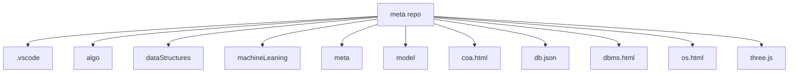

# 📂 MetaVerse Repository
## Augmented Reality in learning, covering **Algorithms, Data Structures, Machine Learning, Models, Web Development, Computer Networks and Operating Systems**.


## 📑 Repository Structure
```
meta/
├── .vscode/ 

├── algo/ 

├── dataStructures/ 

├── machineLeaning/ 

├── meta/ 

├── model/ 

├── coa.html

├── db.json

├── dbms.html

├── os.html 

└── three.js 
```
## 📊 Language Breakdown


---

## 🗂 Contents Overview

### 📁 **algo/**
- Contains various algorithm implementations with step-by-step explanations.

### 📁 **dataStructures/**
- Data structure code visualization to study and understand.

### 📁 **machineLeaning/**
- Machine learning scripts, models, and experiments.

### 📁 **meta/**
- Repository meta files if frontend.

### 📁 **model/**
- 3D ML models to understand their working.

### 📄 **coa.html**
- 3D models **Computer Organization & Architecture**.

### 📄 **dbms.html**
- Visualize **Database Management Systems**.

### 📄 **os.html**
- Working of different **Operating Systems** Algorithms.

### 📄 **db.json**
- JSON file for mock database or configuration.

### 📄 **three.js**
- JavaScript 3D rendering example with **Three.js**.

### 📄 **cn.html**
- AUGMENTED REALITY of network topologies.

---

## 🖼 Visualization of File Structure


📌 How to Use
Clone the repository:
git clone https://github.com/afraa786/meta.git
Navigate to the desired folder and explore code or notes.

Open .html files in a browser to view formatted notes.
